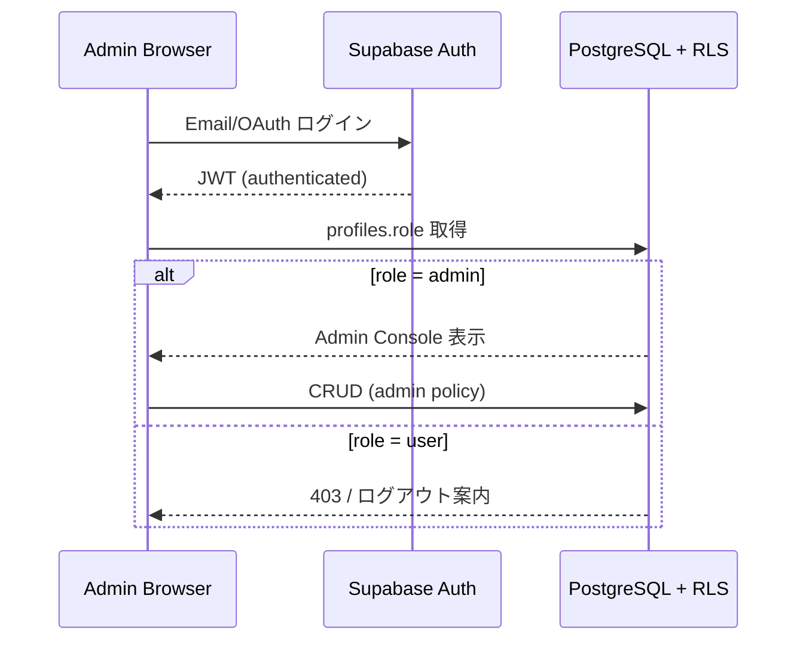
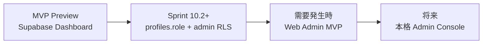

# AI Pilot Admin Console 要件定義・設計

Sprint 10.1 で定義する管理画面（Admin Console）の要件と設計方針。  
Sprint 10.2 で **DB 側の admin 権限基盤**（`003_admin_foundation.sql`）を実装済み。Flutter Admin UI は未実装。

関連ドキュメント:

- [database_schema.md](./database_schema.md) — 現行 Supabase スキーマ（role / 監査カラム / admin RLS 含む）
- [QA_CHECKLIST.md](./QA_CHECKLIST.md) — ユーザー向けアプリの QA 観点
- [SETUP.md](./SETUP.md) — 開発・ビルド手順

---

## 1. 管理画面の目的

AI Pilot の**コンテンツマスタ**（Workflow、AI ツール、カテゴリ、Recommendation 等）を、開発者や運用担当が**安全かつ効率的に更新**するための手段を定義する。

### 解決したい課題

| 課題 | 現状 | 管理画面で解決したいこと |
|------|------|---------------------------|
| コンテンツ更新 | SQL / Supabase Dashboard 手動編集 | 非エンジニアでも更新可能な UI |
| 公開制御 | `is_published` カラムはあるが RLS は全件公開 | 下書き・公開の切り替え |
| 変更履歴 | `created_by` / `updated_by` なし | 誰がいつ変更したか追える |
| 権限 | コンテンツマスタに admin 用 RLS なし | admin のみ CRUD 可能 |
| 運用コスト | Seed SQL の再実行や Table Editor 依存 | 日常更新の手順を標準化 |

### スコープ外（本ドキュメント）

- エンドユーザー向け Flutter アプリの UI 改修
- Analytics / 監査ログ基盤の構築
- 課金・サブスクリプション管理

---

## 2. 管理対象

現行スキーマ（Sprint 8.2）に存在する**コンテンツマスタ**を管理対象とする。  
ユーザー依存データ（`favorites`, `workflow_run_histories`）は参照のみ、または将来拡張とする。

### 2.1 Workflow

| 項目 | 内容 |
|------|------|
| テーブル | `workflows` |
| 主なカラム | `title`, `description`, `category_id`, `estimated_minutes`, `tags`, `is_published` |
| 関連 | `workflow_steps`（1:N）、`recommendation_workflows`（N:M） |
| 運用上の注意 | 公開前は `is_published = false` で下書き運用を想定 |

### 2.2 WorkflowStep

| 項目 | 内容 |
|------|------|
| テーブル | `workflow_steps` |
| 主なカラム | `workflow_id`, `step_order`, `title`, `instruction`, `description`, `ai_tool_id`, `prompt_template_id`, `notes` |
| 関連 | Workflow 編集画面内でステップ一覧・並び替え・追加削除 |
| 運用上の注意 | `step_order` の一意性・連番を UI 側で担保 |

### 2.3 Category

| 項目 | 内容 |
|------|------|
| テーブル | `categories` |
| 主なカラム | `name`, `description`, `icon_name`, `sort_order` |
| 関連 | `workflows.category_id` |
| 運用上の注意 | 削除時は FK `ON DELETE SET NULL` — 紐づく Workflow のカテゴリが外れる |

### 2.4 AITool

| 項目 | 内容 |
|------|------|
| テーブル | `ai_tools` |
| 主なカラム | `name`, `description`, `url`, `type`, `icon_name` |
| 関連 | `workflow_steps.ai_tool_id`, `prompt_templates.recommended_ai_tool_id` |
| 運用上の注意 | `type` は Flutter `AIToolType` 相当（`chat`, `image` 等） |

### 2.5 PromptTemplate

| 項目 | 内容 |
|------|------|
| テーブル | `prompt_templates` |
| 主なカラム | `title`, `content`, `description`, `recommended_ai_tool_id`, `variable_names`, `tags` |
| 関連 | `workflow_steps.prompt_template_id` |
| 運用上の注意 | MVP 管理画面では Workflow 編集からの参照・簡易編集を優先。独立 CRUD 画面は将来 |

### 2.6 Recommendation

| 項目 | 内容 |
|------|------|
| テーブル | `recommendations`, `recommendation_workflows` |
| 主なカラム | `title`, `description`, `icon`, `color`, `priority` + 中間テーブルの `workflow_id`, `sort_order` |
| 関連 | ホーム「何をしたいですか？」セクション |
| 運用上の注意 | 1 Recommendation に複数 Workflow を紐づけ可能 |

### 管理対象外（MVP）

| 対象 | 理由 |
|------|------|
| `profiles`（一般ユーザー） | サポート用途は将来。MVP では role 付与のみ DB 操作 |
| `favorites` | ユーザー個人データ |
| `workflow_run_histories` | ユーザー個人データ |
| `auth.users` | Supabase Auth 管理 |

---

## 3. 画面一覧

Admin Console は **Web アプリ** を想定した画面構成とする（実装方式は §9 参照）。

### 3.1 Dashboard

**目的:** 運用状況の俯瞰とクイックアクション。

| 要素 | 内容 |
|------|------|
| サマリー | 公開 Workflow 数 / 下書き数、Category 数、AI ツール数、Recommendation 数 |
| クイックリンク | Workflow 新規作成、AI ツール追加、Recommendation 編集 |
| 最近の更新 | `workflows.updated_at` 降順（`created_by` 追加後は更新者表示） |
| 注意表示 | 未公開 Workflow、Recommendation 未紐づけ Workflow 等の簡易アラート |

### 3.2 Workflow 一覧

| 要素 | 内容 |
|------|------|
| 一覧 | タイトル、カテゴリ、ステップ数、公開状態、`updated_at` |
| フィルタ | カテゴリ、公開 / 下書き、タイトル検索 |
| ソート | 更新日、タイトル、カテゴリ |
| アクション | 新規作成、編集、公開切替、削除（確認ダイアログ） |

### 3.3 Workflow 作成 / 編集

**1 画面（またはタブ）で Workflow 本体 + ステップを編集。**

#### Workflow 基本情報

| フィールド | 必須 | 備考 |
|-----------|:----:|------|
| title | ✓ | |
| description | | 長文可 |
| category_id | | ドロップダウン |
| estimated_minutes | | 整数 |
| tags | | タグ入力（配列） |
| is_published | ✓ | トグル |

#### ステップ編集（WorkflowStep）

| フィールド | 必須 | 備考 |
|-----------|:----:|------|
| step_order | ✓ | ドラッグで並び替え |
| title | ✓ | |
| instruction | | ユーザー向け作業指示 |
| description | | |
| ai_tool_id | | AI ツール選択 |
| prompt_template_id | | 既存テンプレ選択 or 新規作成（将来） |
| notes | | 運用メモ |

**保存:** Workflow と Steps をトランザクション相当で一括保存（API 側で順序再採番）。

### 3.4 AI ツール一覧

| 要素 | 内容 |
|------|------|
| 一覧 | name, type, url, 参照中ステップ数（将来） |
| フィルタ | type |
| アクション | 新規作成、編集、削除（参照あり時は警告） |

### 3.5 AI ツール作成 / 編集

| フィールド | 必須 | 備考 |
|-----------|:----:|------|
| name | ✓ | |
| description | | |
| url | | 公式 URL |
| type | ✓ | enum: chat / image / audio / video / code 等 |
| icon_name | | Material Icons 名 |

### 3.6 Category 管理

| 要素 | 内容 |
|------|------|
| 一覧 | name, sort_order, 紐づく Workflow 数 |
| 編集 | インライン or モーダル |
| 並び替え | `sort_order` ドラッグ |
| 削除 | 紐づき Workflow がある場合は警告 |

### 3.7 Recommendation 管理

| 要素 | 内容 |
|------|------|
| 一覧 | title, priority, 紐づく Workflow 数 |
| 編集 | title, description, icon, color, priority |
| Workflow 紐づけ | 複数選択 + `sort_order` |
| 並び替え | priority またはドラッグ |

---

## 4. 権限設計

### 4.1 基本方針

- **admin ユーザーのみ** Admin Console にアクセス可能
- 一般ユーザー（`role = user`）はコンテンツマスタの CRUD 不可（現行どおり Public read のみ）
- Admin Console は **Supabase Auth でログイン**し、`profiles.role` で認可

### 4.2 ロール定義（予定）

| role | 説明 | Admin Console | コンテンツ CRUD |
|------|------|:-------------:|:---------------:|
| `user` | 一般利用者（デフォルト） | ✗ | ✗ |
| `admin` | 運用・編集者 | ✓ | ✓ |

将来拡張例: `editor`（コンテンツのみ）、`super_admin`（ユーザー role 変更）— MVP では **`user` / `admin` の 2 値**に留める。

### 4.3 認証フロー（Web Admin 想定）



### 4.4 RLS 方針（追加予定）

コンテンツマスタ各テーブルに admin 用ポリシーを追加:

```sql
-- 例: workflows
CREATE POLICY "Admins can manage workflows"
  ON public.workflows
  FOR ALL
  TO authenticated
  USING (
    EXISTS (
      SELECT 1 FROM public.profiles
      WHERE profiles.id = auth.uid()
        AND profiles.role = 'admin'
    )
  )
  WITH CHECK (...同上...);
```

`profiles.role` の UPDATE は **admin のみ**、または **service role + Supabase Dashboard** で初回 admin を手動付与。

### 4.5 admin ユーザーの初回作成

MVP 段階の想定手順:

1. 対象ユーザーで通常登録（または OAuth）
2. Supabase SQL Editor で `UPDATE profiles SET role = 'admin' WHERE id = '<uuid>'`
3. 以降 Admin Console からログイン

---

## 5. DB 変更案

マイグレーション [`supabase/migrations/003_admin_foundation.sql`](../supabase/migrations/003_admin_foundation.sql) として **Sprint 10.2 で適用済み**。

### 5.1 profiles.role

```sql
ALTER TABLE public.profiles
  ADD COLUMN role text NOT NULL DEFAULT 'user'
  CHECK (role IN ('user', 'admin'));

CREATE INDEX profiles_role_idx ON public.profiles (role);
```

| カラム | 型 | デフォルト | 備考 |
|--------|-----|-----------|------|
| `role` | text | `'user'` | `'user'` \| `'admin'` |

**handle_new_user トリガー:** 新規ユーザーは `role = 'user'` のまま（明示指定不要）。

**role 自己昇格防止:** `profiles_protect_role` トリガーにより、`auth.uid()` があるリクエスト（Flutter / anon key 経由）では `role` 変更不可。初回 admin 付与は SQL Editor（service role）で行う。

**RLS:**

- 一般ユーザーは従来どおり本人のみ SELECT / UPDATE（`display_name`, `avatar_url` のみ実質変更）
- コンテンツマスタの CRUD は §11 の admin ポリシー

### 5.2 workflows.created_by / workflows.updated_by

```sql
ALTER TABLE public.workflows
  ADD COLUMN created_by uuid REFERENCES public.profiles (id) ON DELETE SET NULL,
  ADD COLUMN updated_by uuid REFERENCES public.profiles (id) ON DELETE SET NULL;

CREATE INDEX workflows_created_by_idx ON public.workflows (created_by);
CREATE INDEX workflows_updated_by_idx ON public.workflows (updated_by);
```

| カラム | 型 | 備考 |
|--------|-----|------|
| `created_by` | uuid FK → profiles | INSERT 時は NULL 可。将来 Admin API で明示セット |
| `updated_by` | uuid FK → profiles | UPDATE 時に `workflows_set_updated_by` トリガーで `auth.uid()` を自動設定 |

**実装（Sprint 10.2）:**

- `set_workflows_updated_by` — BEFORE UPDATE で `updated_by = auth.uid()`
- `created_by` は Admin 操作時にアプリ/API からセット（未実装）。Seed 行は NULL のまま

### 5.3 将来検討（MVP 外）

| 変更 | 目的 |
|------|------|
| 他テーブルにも `created_by` / `updated_by` | 監査の統一 |
| `workflows` RLS を `is_published = true` に限定 | 下書き非公開 |
| `prompt_templates` 独立管理 | Workflow 外からのテンプレ再利用 |
| ソフトデリート `deleted_at` | 誤削除復旧 |

---

## 6. MVP 管理画面でやること

MVP Admin Console（または Supabase Dashboard 運用）で**最低限**カバーする範囲。

| # | 機能 | 優先度 | 備考 |
|---|------|:------:|------|
| 1 | admin role による認可基盤 | P0 | DB + RLS |
| 2 | Workflow 一覧・公開切替 | P0 | 日常更新の中心 |
| 3 | Workflow 基本情報の編集 | P0 | title, description, category, is_published |
| 4 | WorkflowStep の追加・編集・並び替え | P0 | ステップ単位の更新 |
| 5 | Category の CRUD + sort_order | P1 | ホームフィルタに直結 |
| 6 | AI ツールの CRUD | P1 | ステップ編集の前提 |
| 7 | Recommendation の CRUD + Workflow 紐づけ | P1 | ホーム「何をしたいですか？」 |
| 8 | PromptTemplate の参照・選択 | P1 | Workflow 編集内。新規作成は SQL でも可 |
| 9 | Dashboard 簡易サマリー | P2 | 件数表示程度 |

**Supabase Dashboard のみで運用する場合（MVP 初期）:**

- Table Editor で上記テーブルを直接編集
- SQL Editor で Seed 再実行・一括更新
- admin role 付与は SQL

---

## 7. MVP 管理画面でやらないこと

| 機能 | 理由 |
|------|------|
| Flutter アプリ内の隠し Admin 画面 | ユーザー向け品質・審査・バンドルサイズの観点で後回し（§10） |
| 一般ユーザー向けプロフィール管理 | サポート範囲外 |
| favorites / 実行履歴の閲覧・編集 | 個人データ。プライバシー・必要性低 |
| リッチテキスト / Markdown WYSIWYG | MVP は plain text |
| 画像アップロード（アイコン・サムネ） | URL / icon_name 文字列で十分 |
| ワークフローのバージョン履歴 | 監査ログ基盤が必要 |
| 多言語（i18n）管理 | 日本語のみ |
| 一括インポート / エクスポート（CSV） | Seed SQL で代替 |
| ロール管理 UI（admin 付与画面） | 初回は SQL 手動 |
| Analytics ダッシュボード | 別基盤 |
| プレビュー（アプリ内表示シミュレーション） | 工数大。QA アプリで確認 |

---

## 8. 将来拡張

| フェーズ | 内容 |
|----------|------|
| Phase 2 | PromptTemplate 独立管理、下書きプレビュー URL、公開スケジュール |
| Phase 3 | `editor` ロール、変更履歴テーブル、監査ログ |
| Phase 4 | 一括インポート / エクスポート、全文検索管理、A/B テスト用 Recommendation |
| Phase 5 | ユーザーサポート（お気に入り・履歴参照）、利用統計、コンテンツ承認ワークフロー |

技術候補:

- **Admin Web:** Next.js / React + Supabase JS、または Retool / Refine 等の低コード
- **API:** Supabase PostgREST（RLS 前提）+ Edge Functions（複雑な一括保存）
- **認証:** Supabase Auth（Email + Google）。Admin 専用 OAuth 制限は将来

---

## 9. Flutter アプリ内 Admin vs 別 Web 管理画面

### 9.1 Flutter アプリ内の隠し Admin 画面

| 観点 | 評価 |
|------|------|
| 開発速度（初期） | △ ルート・認可・UI を Flutter に追加 |
| ユーザー向け品質 | ✗ 本番 APK/IPA に管理 UI が同梱。誤公開リスク |
| 運用 | △ スマホ画面で長文・ステップ編集は非効率 |
| 権限 | △ `role` チェック + 隠し URL / 長押し等の秘匿は脆い |
| デプロイ | ✗ コンテンツ更新のたびにアプリ審査は不要だが、Admin UI 変更もアプリ release に依存 |
| コード共有 | ◎ Domain / DTO は共有可能 |

**向いているケース:** フィールドオペレータがモバイルのみ、極小チーム、オフライン編集が必要な場合。

### 9.2 別 Web 管理画面

| 観点 | 評価 |
|------|------|
| 開発速度（初期） | ◎ Supabase Dashboard のみなら即日運用可能 |
| ユーザー向け品質 | ◎ Flutter アプリと完全分離 |
| 運用 | ◎ 大画面・キーボードで Workflow / プロンプト編集に適する |
| 権限 | ◎ Web 専用ドメイン + admin RLS で明確 |
| デプロイ | ◎ Admin と Consumer アプリを独立リリース |
| コード共有 | △ TypeScript で DTO 再定義（OpenAPI / 手動同期） |

**向いているケース:** MVP Preview 以降の標準運用、複数人編集、PC 中心のオペレーション。

### 9.3 Supabase Dashboard 運用（Web Admin の前段）

| 観点 | 評価 |
|------|------|
| 開発速度 | ◎ 追加実装ゼロ |
| コスト | ◎ 無料枠内 |
| UX | △ Table Editor は非エンジニアには厳しい |
| 安全性 | △ service role / Dashboard は権限強。操作ミスに注意 |
| スケール | ✗ コンテンツ量・編集頻度が増えると限界 |

**向いているケース:** MVP Preview 〜 初期コンテンツ数件、編集者がエンジニアのみ。

### 比較まとめ

| 方式 | 初期コスト | 運用性 | アプリ品質への影響 | MVP 適合 |
|------|:----------:|:------:|:------------------:|:--------:|
| Flutter 内 Admin | 中 | 低 | 高（ネガティブ） | ✗ |
| 別 Web Admin | 中〜高 | 高 | なし | ◎ |
| Supabase Dashboard | 最低 | 中（エンジニア向け） | なし | ◎（過渡期） |

---

## 10. 推奨方針

### 結論

**まずは Flutter アプリ内の隠し Admin 画面ではなく、別 Web 管理画面または Supabase Dashboard 運用から始める。**

### 理由

1. **MVP ではユーザー向けアプリ品質を優先** — 管理 UI を同梱しないことで、審査・バンドル・誤公開リスクを避ける。
2. **管理画面は後回しでよい** — 現行 Seed + SQL でコンテンツは成立しており、更新頻度が低い初期フェーズでは Dashboard で足りる。
3. **編集体験** — WorkflowStep と PromptTemplate は PC キーボード前提の作業量が多い。
4. **権限の明確化** — `profiles.role` + Web 専用 RLS の方が、モバイルアプリ内秘匿 URL より安全。
5. **段階的投資** — Dashboard → 軽量 Web Admin（Retool / Refine 等）→ 本格 Admin の順で、需要に応じて拡張できる。

### 推奨ロードマップ



| 段階 | アクション |
|------|-----------|
| **今すぐ（Sprint 10.1 完了後）** | 本ドキュメントで合意。運用手順を Wiki / SETUP に追記検討 |
| **Sprint 10.2（完了）** | `profiles.role`、`workflows.created_by/updated_by`、admin RLS マイグレーション |
| **コンテンツ更新が週次を超える前** | 最小 Web Admin（Workflow + Category + Recommendation） |
| **非エンジニアが編集開始** | AI ツール・PromptTemplate UI、Dashboard サマリー |
| **やらない** | Flutter 内隠し Admin（Phase 2 以降も原則不要） |

---

## 11. Sprint 10.2 実装内容（Admin 権限基盤）

Sprint 10.2 で Supabase 側に admin 権限基盤を追加した。**Flutter 側の変更はなし。**

マイグレーション: [`supabase/migrations/003_admin_foundation.sql`](../supabase/migrations/003_admin_foundation.sql)

### 11.1 profiles.role

```sql
ALTER TABLE public.profiles
  ADD COLUMN role text NOT NULL DEFAULT 'user'
  CHECK (role IN ('user', 'admin'));
```

- 既存ユーザーはマイグレーション適用時に `role = 'user'` になる（DEFAULT）
- 新規登録ユーザーも `handle_new_user` 経由で `user`

### 11.2 public.is_admin()

```sql
CREATE OR REPLACE FUNCTION public.is_admin(user_id uuid)
RETURNS boolean
LANGUAGE sql
STABLE
SECURITY DEFINER
SET search_path = public
AS $$
  SELECT EXISTS (
    SELECT 1 FROM public.profiles
    WHERE profiles.id = user_id AND profiles.role = 'admin'
  );
$$;
```

- RLS ポリシーから `public.is_admin(auth.uid())` で admin 判定
- `SECURITY DEFINER` + 固定 `search_path` で RLS 迂回読み取りを安全に実施

### 11.3 workflows 監査カラム

| カラム | 自動設定 |
|--------|----------|
| `created_by` | なし（手動 / 将来 Admin API） |
| `updated_by` | UPDATE 時に `set_workflows_updated_by` トリガー |

### 11.4 admin RLS ポリシー

以下 7 テーブルに `"Admins can manage ..."`（`FOR ALL TO authenticated`）を追加:

- `categories`, `ai_tools`, `prompt_templates`, `workflows`, `workflow_steps`
- `recommendations`, `recommendation_workflows`

**維持:** Sprint 8.2 の `"Public read access"` ポリシーは変更なし（anon / authenticated の SELECT）。

### 11.5 初回 admin 付与手順

1. 対象ユーザーでアプリから通常登録（または Supabase Auth で作成）
2. Supabase Dashboard → **SQL Editor** を開く（service role）
3. UUID を確認:

```sql
SELECT id, display_name, role FROM public.profiles;
```

4. admin を付与:

```sql
UPDATE public.profiles
SET role = 'admin'
WHERE id = 'YOUR_USER_ID';
```

5. 付与後、そのユーザー JWT（ログインセッション）で PostgREST 経由のコンテンツ CRUD が可能

> **注意:** Flutter アプリには `service_role` key を**絶対に埋め込まない**。anon key + ユーザー JWT のみ。

### 11.6 注意点

| 項目 | 内容 |
|------|------|
| service_role | SQL Editor / サーバー側のみ。Flutter / Web Admin 本番でもクライアントに置かない |
| role 自己昇格 | `profiles_protect_role` トリガーで JWT 経由の `role` 変更を拒否 |
| 一般ユーザーの書込 | コンテンツマスタへの INSERT/UPDATE/DELETE は引き続き不可（admin のみ） |
| Dashboard Table Editor | service role 相当の権限のため RLS をバイパス — 誤操作に注意 |
| `created_by` | Seed / 既存行は NULL。監査が必要になったら Admin 初回 INSERT 時にセット |
| `is_published` | RLS は依然として全行 Public read。下書き非公開は将来変更 |
| Flutter | 変更不要。admin 操作は Dashboard / 将来 Web Admin から |

### 11.7 適用方法

```bash
# プロジェクトルート
supabase db push

# または SQL Editor / psql（001 → 002 の後に実行）
psql "$DATABASE_URL" -f supabase/migrations/003_admin_foundation.sql
```

---

## 付録 A: 現行スキーマとの対応

| 管理対象 | テーブル | RLS（読取） | RLS（書込） |
|----------|---------|------------|------------|
| Category | `categories` | Public | admin のみ（Sprint 10.2） |
| AITool | `ai_tools` | Public | admin のみ（Sprint 10.2） |
| Workflow | `workflows` | Public | admin のみ（Sprint 10.2） |
| WorkflowStep | `workflow_steps` | Public | admin のみ（Sprint 10.2） |
| PromptTemplate | `prompt_templates` | Public | admin のみ（Sprint 10.2） |
| Recommendation | `recommendations`, `recommendation_workflows` | Public | admin のみ（Sprint 10.2） |

詳細: [database_schema.md](./database_schema.md)

## 付録 B: 用語

| 用語 | 説明 |
|------|------|
| Admin Console | 本ドキュメントで定義するコンテンツ管理 UI 全体 |
| コンテンツマスタ | 全ユーザー共通の参照データ（Workflow 等） |
| MVP Preview | ユーザー向けアプリの初期公開フェーズ（QA_CHECKLIST 参照） |

---

*Document version: Sprint 10.2 — 2026-06-28*
