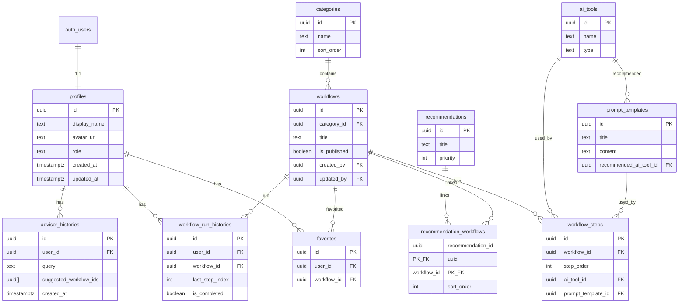

# AI Pilot Database Schema

Sprint 8.2 で定義した Supabase PostgreSQL スキーマ。  
Sprint 10.2 で admin 権限基盤（`role`, 監査カラム, admin RLS）を追加。  
Sprint 11.3 で Advisor 相談履歴（`advisor_histories`）を追加。

マイグレーション:

- [`supabase/migrations/001_initial_schema.sql`](../supabase/migrations/001_initial_schema.sql)
- [`supabase/migrations/002_seed_initial_data.sql`](../supabase/migrations/002_seed_initial_data.sql)
- [`supabase/migrations/003_admin_foundation.sql`](../supabase/migrations/003_admin_foundation.sql)
- [`supabase/migrations/004_advisor_history.sql`](../supabase/migrations/004_advisor_history.sql)

## テーブル一覧

| テーブル | 説明 | RLS |
|---------|------|-----|
| `profiles` | ユーザープロフィール（`auth.users` と 1:1） | 本人のみ SELECT / UPDATE（`role` 自己変更不可） |
| `categories` | ワークフロー分類 | Public read + admin CRUD |
| `ai_tools` | 利用可能な AI ツール定義 | Public read + admin CRUD |
| `workflows` | ワークフロー本体 | Public read + admin CRUD |
| `workflow_steps` | ワークフロー内ステップ | Public read + admin CRUD |
| `prompt_templates` | プロンプトテンプレート | Public read + admin CRUD |
| `favorites` | ユーザーお気に入り | 本人のみ CRUD |
| `workflow_run_histories` | 実行・再開履歴 | 本人のみ CRUD |
| `advisor_histories` | Advisor 相談履歴 | 本人のみ SELECT / INSERT / DELETE |
| `recommendations` | ホーム「何をしたいですか？」カード | Public read + admin CRUD |
| `recommendation_workflows` | おすすめと Workflow の中間テーブル | Public read + admin CRUD |

## ER 図（リレーション）



## カラム詳細

### profiles

| カラム | 型 | 備考 |
|--------|-----|------|
| `id` | uuid PK | `auth.users(id)` を参照 |
| `display_name` | text | |
| `avatar_url` | text | |
| `role` | text NOT NULL | デフォルト `'user'`。`'user'` \| `'admin'`（Sprint 10.2） |
| `created_at` | timestamptz | デフォルト `now()` |
| `updated_at` | timestamptz | 更新トリガーで自動更新 |

メールアドレスは `auth.users.email` に保持し、`profiles` には持たない。  
`role` の変更は JWT 経由では不可（`profiles_protect_role` トリガー）。初回 admin は SQL Editor（service role）で付与。

### categories

| カラム | 型 | 備考 |
|--------|-----|------|
| `id` | uuid PK | `gen_random_uuid()` |
| `name` | text NOT NULL | |
| `description` | text | |
| `icon_name` | text | Material Icons 名など |
| `sort_order` | int | デフォルト `0` |
| `created_at` / `updated_at` | timestamptz | |

### ai_tools

| カラム | 型 | 備考 |
|--------|-----|------|
| `id` | uuid PK | |
| `name` | text NOT NULL | |
| `description` | text | |
| `url` | text | 公式 URL |
| `type` | text | Flutter `AIToolType` 相当（`chat`, `image` 等） |
| `icon_name` | text | |
| `created_at` / `updated_at` | timestamptz | |

### workflows

| カラム | 型 | 備考 |
|--------|-----|------|
| `id` | uuid PK | |
| `title` | text NOT NULL | |
| `description` | text | |
| `category_id` | uuid FK → categories | ON DELETE SET NULL |
| `estimated_minutes` | int | |
| `tags` | text[] | デフォルト `'{}'` |
| `is_published` | boolean | デフォルト `true` |
| `created_by` | uuid FK → profiles | ON DELETE SET NULL。Seed 行は NULL（Sprint 10.2） |
| `updated_by` | uuid FK → profiles | UPDATE 時にトリガーで `auth.uid()` を設定（Sprint 10.2） |
| `created_at` / `updated_at` | timestamptz | |

### workflow_steps

| カラム | 型 | 備考 |
|--------|-----|------|
| `id` | uuid PK | |
| `workflow_id` | uuid FK → workflows | ON DELETE CASCADE |
| `step_order` | int NOT NULL | 実行順（Flutter `WorkflowStep.order` 相当） |
| `title` | text NOT NULL | |
| `instruction` | text | ユーザー向け作業指示 |
| `description` | text | |
| `ai_tool_id` | uuid FK → ai_tools | 任意 |
| `prompt_template_id` | uuid FK → prompt_templates | 任意 |
| `notes` | text | |
| `created_at` / `updated_at` | timestamptz | |

### prompt_templates

| カラム | 型 | 備考 |
|--------|-----|------|
| `id` | uuid PK | |
| `title` | text NOT NULL | |
| `content` | text NOT NULL | |
| `description` | text | |
| `recommended_ai_tool_id` | uuid FK → ai_tools | 任意 |
| `variable_names` | text[] | デフォルト `'{}'` |
| `tags` | text[] | デフォルト `'{}'` |
| `created_at` / `updated_at` | timestamptz | |

### favorites

| カラム | 型 | 備考 |
|--------|-----|------|
| `id` | uuid PK | |
| `user_id` | uuid FK → profiles | ON DELETE CASCADE |
| `workflow_id` | uuid FK → workflows | ON DELETE CASCADE |
| `created_at` | timestamptz | |
| UNIQUE | `(user_id, workflow_id)` | 重複登録防止 |

### workflow_run_histories

| カラム | 型 | 備考 |
|--------|-----|------|
| `id` | uuid PK | |
| `user_id` | uuid FK → profiles | ON DELETE CASCADE |
| `workflow_id` | uuid FK → workflows | ON DELETE CASCADE |
| `last_step_index` | int | デフォルト `0`（0 始まり） |
| `is_completed` | boolean | デフォルト `false` |
| `started_at` | timestamptz | デフォルト `now()` |
| `completed_at` | timestamptz | 未完了は NULL |
| `updated_at` | timestamptz | |
| UNIQUE | `(user_id, workflow_id)` | 1 ユーザー 1 Workflow につき 1 レコード |

### advisor_histories（Sprint 11.3）

| カラム | 型 | 備考 |
|--------|-----|------|
| `id` | uuid PK | `gen_random_uuid()` |
| `user_id` | uuid FK → profiles | ON DELETE CASCADE |
| `query` | text NOT NULL | ユーザーが入力した相談内容 |
| `suggested_workflow_ids` | uuid[] | 提案された Workflow ID 一覧。デフォルト `'{}'` |
| `created_at` | timestamptz | デフォルト `now()` |

ゲスト（未ログイン / ゲストモード）は RLS により INSERT 不可。Flutter 側でも `isAuthenticatedProvider` が false のとき保存しない。

### recommendations

| カラム | 型 | 備考 |
|--------|-----|------|
| `id` | uuid PK | |
| `title` | text NOT NULL | |
| `description` | text | |
| `icon` | text | |
| `color` | text | HEX 文字列（例: `#5B5CEB`） |
| `priority` | int | 小さいほど先頭、デフォルト `0` |
| `created_at` / `updated_at` | timestamptz | |

### recommendation_workflows

| カラム | 型 | 備考 |
|--------|-----|------|
| `recommendation_id` | uuid PK, FK | ON DELETE CASCADE |
| `workflow_id` | uuid PK, FK | ON DELETE CASCADE |
| `sort_order` | int | デフォルト `0` |

## インデックス

| インデックス | カラム |
|-------------|--------|
| `workflows_category_id_idx` | `workflows.category_id` |
| `workflows_created_by_idx` | `workflows.created_by` |
| `workflows_updated_by_idx` | `workflows.updated_by` |
| `profiles_role_idx` | `profiles.role` |
| `workflow_steps_workflow_id_idx` | `workflow_steps.workflow_id` |
| `favorites_user_id_idx` | `favorites.user_id` |
| `favorites_workflow_id_idx` | `favorites.workflow_id` |
| `workflow_run_histories_user_id_idx` | `workflow_run_histories.user_id` |
| `advisor_histories_user_id_idx` | `advisor_histories.user_id` |
| `advisor_histories_created_at_idx` | `advisor_histories.created_at DESC` |
| `recommendations_priority_idx` | `recommendations.priority` |
| `recommendation_workflows_recommendation_id_idx` | `recommendation_workflows.recommendation_id` |

## トリガー

### profiles 自動作成

`auth.users` に INSERT されたタイミングで `profiles` に 1 行 INSERT する。

- 関数: `public.handle_new_user()`（`SECURITY DEFINER`）
- トリガー: `on_auth_user_created`
- `display_name` は OAuth メタデータ → メールのローカル部の順でフォールバック

### profiles.role 保護（Sprint 10.2）

- 関数: `public.protect_profiles_role()`
- トリガー: `profiles_protect_role`（BEFORE UPDATE）
- `auth.uid()` があるリクエストでは `role` 列の変更を拒否

### workflows.updated_by 自動設定（Sprint 10.2）

- 関数: `public.set_workflows_updated_by()`
- トリガー: `workflows_set_updated_by`（BEFORE UPDATE）
- `NEW.updated_by = auth.uid()`

### public.is_admin()（Sprint 10.2）

- `public.is_admin(user_id uuid) → boolean`
- `SECURITY DEFINER`, `SET search_path = public`
- `profiles.role = 'admin'` かどうかを返す（admin RLS ポリシーで使用）

### updated_at 自動更新

`public.set_updated_at()` を以下のテーブル UPDATE 前に実行:

- `profiles`, `categories`, `ai_tools`, `workflows`, `workflow_steps`
- `prompt_templates`, `workflow_run_histories`, `recommendations`

## RLS 方針

### Public read（`anon`, `authenticated`）

誰でも SELECT 可能。ゲストモード（未ログイン）でもコンテンツ閲覧を想定。

- `categories`
- `ai_tools`
- `workflows`
- `workflow_steps`
- `prompt_templates`
- `recommendations`
- `recommendation_workflows`

> **Note:** `workflows.is_published` カラムは将来の下書き運用用。現行 RLS では全行を公開読み取り可能としている。下書き非公開が必要になったら `USING (is_published = true)` に変更する。

### Authenticated user own data

`auth.uid()` と `user_id` / `id` が一致する行のみ操作可能。

| テーブル | SELECT | INSERT | UPDATE | DELETE |
|---------|--------|--------|--------|--------|
| `profiles` | 本人 | トリガーのみ | 本人（`role` 変更不可） | — |
| `favorites` | 本人 | 本人 | — | 本人 |
| `workflow_run_histories` | 本人 | 本人 | 本人 | 本人 |
| `advisor_histories` | 本人 | 本人 | — | 本人 |

### Admin CRUD（`authenticated` + `profiles.role = 'admin'`）

Sprint 10.2 で追加。`public.is_admin(auth.uid())` が true のユーザーのみ INSERT / UPDATE / DELETE 可能。  
Public read ポリシーと併存（一般ユーザー・ゲストは SELECT のみ）。

| テーブル | ポリシー名 |
|---------|-----------|
| `categories` | `Admins can manage categories` |
| `ai_tools` | `Admins can manage ai_tools` |
| `prompt_templates` | `Admins can manage prompt_templates` |
| `workflows` | `Admins can manage workflows` |
| `workflow_steps` | `Admins can manage workflow_steps` |
| `recommendations` | `Admins can manage recommendations` |
| `recommendation_workflows` | `Admins can manage recommendation_workflows` |

初回 admin 付与:

```sql
UPDATE public.profiles SET role = 'admin' WHERE id = 'YOUR_USER_ID';
```

（SQL Editor / service role で実行。Flutter に service_role key を入れないこと）

## 今回作らないテーブル

| 対象 | 理由 |
|------|------|
| `auth.users` 相当 | Supabase Auth が提供 |
| ゲストセッション | Flutter 側 `guestModeProvider` でローカル管理（Sprint 8.1） |
| ステップ単位の完了メモ / 進捗詳細 | `workflow_run_histories.last_step_index` で十分。必要になれば拡張 |
| ユーザー設定（通知・テーマ等） | 未実装機能 |
| 監査ログ / Analytics | 別基盤で対応予定 |
| 全文検索用 VIEW / マテリアライズド VIEW | 現行はアプリ側フィルタ。必要時に追加 |
| `favorites` / `workflow_run_histories` の Seed | ユーザー依存のため別途（認証後にアプリ or 手動投入） |

## Seed データ（Sprint 8.3）

マイグレーション: [`supabase/migrations/002_seed_initial_data.sql`](../supabase/migrations/002_seed_initial_data.sql)

Flutter Mock データ（`mock_seed_data.dart`, `mock_recommendation_seed_data.dart`）と同等の初期コンテンツを投入する。  
`INSERT ... ON CONFLICT ... DO UPDATE` により再実行可能。

### 投入件数

| テーブル | 件数 |
|---------|------|
| `categories` | 5 |
| `ai_tools` | 8 |
| `prompt_templates` | 12 |
| `workflows` | 5 |
| `workflow_steps` | 12 |
| `recommendations` | 6 |
| `recommendation_workflows` | 8 |

### 固定 UUID スキーム

Repository 置き換え時に Mock ID と対応付けやすいよう、エンティティ種別ごとにプレフィックスを付与している。

| プレフィックス | エンティティ | 例（Mock ID → UUID） |
|---------------|-------------|---------------------|
| `10000000-...` | categories | `cat_video` → `...0001` |
| `20000000-...` | ai_tools | `tool_chatgpt` → `...0001` |
| `30000000-...` | prompt_templates | `prompt_short_idea` → `...0001` |
| `40000000-...` | workflows | `wf_youtube_short` → `...0001` |
| `50000000-...` | workflow_steps | `step_short_1` → `...0001` |
| `60000000-...` | recommendations | `rec_youtube` → `...0001` |

完全な Mock ID マッピングは SQL ファイル先頭コメントを参照。

### コンテンツ概要

**カテゴリ:** 動画制作 / 文章作成 / 画像生成 / 調査 / 開発

**AI ツール:** ChatGPT, Claude, Gemini, Perplexity, Canva, ElevenLabs, CapCut, Cursor

**Workflow:**

| UUID suffix | タイトル | ステップ数 | カテゴリ |
|-------------|---------|-----------|---------|
| `...0001` | YouTubeショートを作る | 4 | 動画制作 |
| `...0002` | ブログ記事を書く | 2 | 文章作成 |
| `...0003` | SNS投稿を作る | 2 | 画像生成 |
| `...0004` | 調査レポートを作る | 2 | 調査 |
| `...0005` | Flutterアプリを作る | 2 | 開発 |

**Recommendation（目的カード）:**

| priority | タイトル | 紐づく Workflow |
|----------|---------|----------------|
| 1 | YouTubeを始めたい | YouTubeショート |
| 2 | 副業を始めたい | SNS投稿, ブログ記事 |
| 3 | AIを学びたい | 調査レポート, Flutterアプリ |
| 4 | ブログを書きたい | ブログ記事 |
| 5 | SNSを伸ばしたい | SNS投稿 |
| 6 | 資料を作りたい | 調査レポート |

### Seed に含めないデータ

- `profiles` — `auth.users` 作成トリガーで自動生成
- `favorites` — Mock の `user-1` / `fav-1` 等は文字列 ID のため、Repository 置き換え時に認証ユーザー UUID で投入
- `workflow_run_histories` — 同上（ユーザー実行データ）

## 適用方法

```bash
# Supabase CLI（プロジェクトルート）
supabase db push

# または SQL Editor / psql で直接実行（順番に適用）
psql "$DATABASE_URL" -f supabase/migrations/001_initial_schema.sql
psql "$DATABASE_URL" -f supabase/migrations/002_seed_initial_data.sql
psql "$DATABASE_URL" -f supabase/migrations/003_admin_foundation.sql
psql "$DATABASE_URL" -f supabase/migrations/004_advisor_history.sql
```
